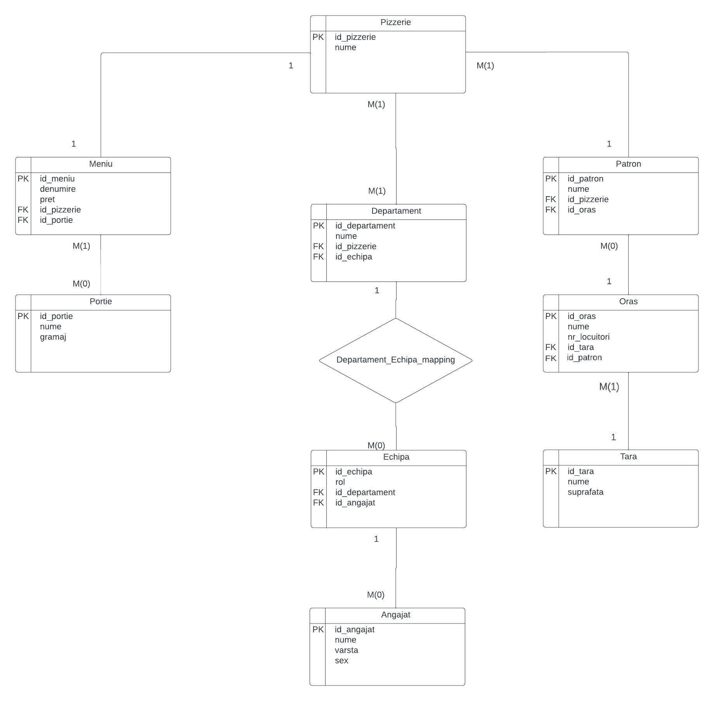

# SQL Database for a Pizzeria Management System

This project was created during my Database course. It involves designing and implementing a database using Oracle SQL Developer. It highlights various database concepts, such as entity relationships, primary and foreign keys, and the extraction of data through complex SQL queries. The primary objective was to demonstrate the creation of a comprehensive database, the establishment of relationships between different entities, and the retrieval of meaningful information using SQL commands.

